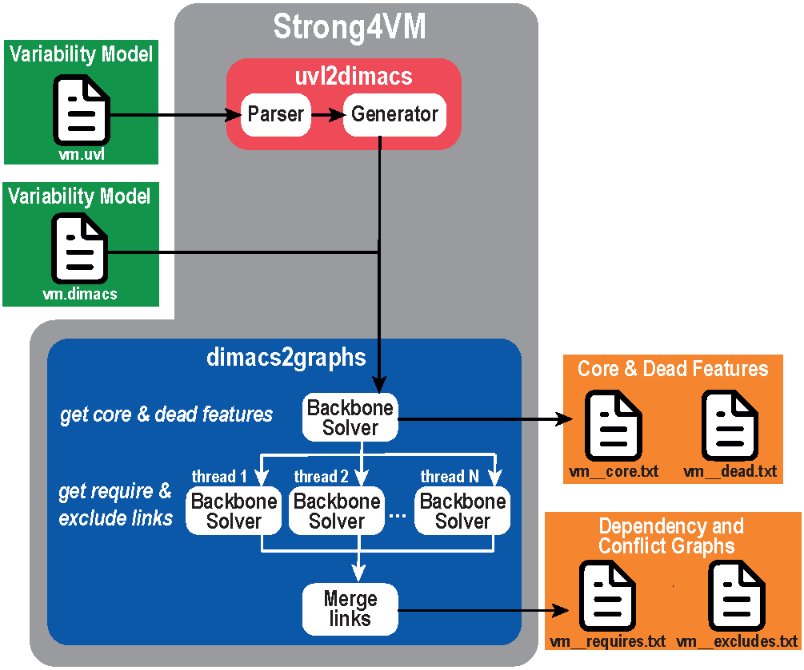

# Strong4VM


*A tool for extracting Strong Transitive Dependency and Conflict Graphs from Variability Models*

## 📋 Overview

*Variability Models* are commonly used to represent the configuration space of software systems. These models specify the available configurable options or *features*, along with the constraints that govern these features (e.g., if feature *A* is enabled in a configuration, then feature *B* must also be enabled, while feature *C* must be disabled).

However, these constraints result in numerous additional indirect relationships due to their chaining. Reasoning about these relationships is extremely challenging in all but the most trivial variability models.

**Strong4VM** identifies all transitive strong relationships between features and represents them as graphs. The term *transitive* refers to relationships that can be formed by linking other relationships defined in the variability model, while *strong* indicates that these relationships are valid in all configurations that comply with the variability model.

**✨ Key Features:**

-   🎯 Unified interface: Unified interface: Single tool for UVL or DIMACS inputs. The [Universal Variability Language](https://universal-variability-language.github.io/) (UVL) is the standard notation for variability models; however, Strong4VM can also generate graphs for the Boolean translations of any variability model notation. This is made possible by its support for DIMACS files. For example, it can generate graphs using [KconfigReader](https://github.com/ckaestne/kconfigreader) first to convert Kconfig files (used in Linux, BusyBox, axTLS, and more) into Boolean formulas.

-   ⚡ High performance: Multi-threaded graph generation with configurable parallelism

-   📈 Comprehensive: Generates requires/excludes graphs and core/dead feature lists

-   ✅ Well-tested: Validated against [5,709 real-world variability models](https://doi.org/10.5281/zenodo.17277788).

## 🚀 Quick Start

### 💾 Installation

``` bash
# Navigate to the strong4vm
cd strong4vm

# Build the tool
make

# Optional: Install to ~/bin
make install
```

Strong4Vm has been tested on Linux and macOS.

### 💻 Basic Usage

``` bash
# Analyze a UVL feature model
./bin/strong4vm model.uvl

# Analyze a DIMACS formula
./bin/strong4vm formula.dimacs

# Use 8 threads for fast processing
./bin/strong4vm model.uvl -t 8

# Custom output directory and keep DIMACS
./bin/strong4vm model.uvl -o ./output -k
```

### 📁 Output Files

For input `model.uvl` or `model.dimacs`, Strong4VM generates:

-   `model__requires.net` - Strong transitive dependency graph (a directed graph in [Pajek](http://mrvar.fdv.uni-lj.si/pajek/DrawEPS.htm) format)

-   `model__excludes.net` - Strong transitive conflict graph (an undirected graph in [Pajek](http://mrvar.fdv.uni-lj.si/pajek/DrawEPS.htm) format)

-   `model__core.txt` - Core features (enabled in all configurations)

-   `model__dead.txt` - Dead features (disabled in all configurations)

## 🏗️ Building

### 📦 Prerequisites

-   **C++17** compatible compiler (g++ 7+ or clang++ 5+)
-   **CMake** 3.10+
-   **Make**
-   **zlib** (for MiniSat)

### 🔨 Building Strong4VM (Unified CLI)

From the repository root:

``` bash
make                  # Build strong4vm (builds all dependencies automatically)
make install          # Install to ~/bin
make clean            # Clean build artifacts
make clean-all        # Deep clean (including all components)
make help             # Show all available targets
```

Output: `bin/strong4vm`

## 📖 Usage

### 🎯 CLI

``` bash
# Basic usage
./bin/strong4vm model.uvl
./bin/strong4vm formula.dimacs

# Advanced options
./bin/strong4vm model.uvl -t 4              # Use 4 threads
./bin/strong4vm model.uvl -o ./output -k    # Custom output + keep DIMACS
./bin/strong4vm model.uvl -t 8 -o ./results # 8 threads + custom output
```

**⚙️ Options:**

-   `-t, --threads N` - Number of threads for graph generation (default: 1).
-   `-o, --output DIR` - Output directory (default: same as input file)
-   `-k, --keep-dimacs` - Keep intermediate DIMACS file (UVL input only)
-   `-h, --help` - Display help message

### 🔗 API

**See [API Documentation](docs/html/index.html) for usage details.**

Build API examples:

``` bash
make api-examples
```

The resulting binaries will be generated in the `./bin` folder.

## 🏛️ Architecture

### 🔍 Architecture Overview

As the following figure shows, Strong4VM consists of three main components: two compilers, one that translates UVL to DIMACS and another that converts DIMACS to Graphs, and a Backbone solver that detects all transitive strong dependencies and conflicts represented in the graphs.



### 🔄 uvl2dimacs Architecture

Multi-layer design for converting UVL feature models to CNF format using ANTLR4 parser.

**For detailed architecture, see [Doxygen Documentation](docs/html/group__UVL2Dimacs.html)**

### 📊 dimacs2graphs Architecture

Analyzes SAT formulas using backbone detection to generate dependency graphs. Supports multi-threaded parallel processing.

**For detailed architecture, see [Doxygen Documentation](docs/html/group__ParallelGraphs.html)**

### 🧠 Backbone Solver Architecture

High-performance backbone detection engine using MiniSat with activity bumping heuristics.

**For detailed architecture, see [Doxygen Documentation](docs/html/group__API.html)**

## 📄 Input Formats

### 📝 UVL Format

Universal Variability Language feature model format. See [UVL specification](https://universal-variability-language.github.io/).

### 🔢 DIMACS CNF Format

Standard SAT solver input format:

```         
p cnf <variables> <clauses>
<literal1> <literal2> ... 0
<literal1> <literal2> ... 0
...
```

-   Lines starting with `c` are comments
-   For dimacs2graphs, comments like `c <var_number> <feature_name>` map variables to feature names

## 📚 Documentation

### 📖 Generating Documentation

Generate comprehensive Doxygen documentation:

``` bash
# Unified project documentation
make docs
# Output: docs/html/index.html
```

**Requirements:** - Doxygen 1.9.0+ - Graphviz (optional, for diagrams)

### 📁 Project Structure

```         
strong4vm/
├── bin/                    # Built executables
├── cli/                    # Strong4VM CLI source
├── api/                    # Strong4VM Unified API
│   ├── include/            # Public headers
│   ├── src/                # Implementation
│   ├── examples/           # Usage examples
│   └── docs/               # API documentation
├── uvl2dimacs/             # UVL to DIMACS converter
│   ├── cli/                # CLI tool
│   ├── api/                # C++ API (include/, src/, examples/)
│   ├── generator/          # Core conversion logic
│   ├── parser/             # ANTLR4 UVL parser
│   ├── build/              # CMake build artifacts
│   ├── docs/               # Component documentation
│   └── third_party/        # ANTLR4 runtime dependencies
├── dimacs2graphs/          # DIMACS to graphs generator
│   ├── cli/                # CLI tool
│   ├── api/                # C++ API
│   ├── backbone_solver/    # Backbone detection engine
│   │   ├── src/
│   │   │   ├── api/        # Backbone Solver API
│   │   │   ├── detectors/  # Detection algorithms
│   │   │   ├── data_structures/ # Core data structures
│   │   │   ├── io/         # Input/output handling
│   │   │   ├── minisat/    # MiniSat SAT solver
│   │   │   └── minisat_interface/ # IPASIR wrapper
│   │   ├── bin/            # Built executables
│   │   └── docs/           # Component documentation
│   ├── bin/                # Component executables
│   └── docs/               # Component documentation
├── examples/               # Sample UVL feature models (45+ models)
├── figures/                # Architecture diagrams (architecture.png, icon.svg)
├── docs/                   # Generated Doxygen documentation
├── Makefile                # Build system orchestration
└── README.md               # This file
```

## ⚠️ Limitations

uvl2dimacs has the following Limitations

1.  **Feature Cardinality:** UVL `cardinality [1..*]` notation not expanded (requires indexed feature generation)
2.  **Arithmetic Constraints:** Comparison and arithmetic operators filtered out (requires SMT solver, not pure SAT)

## 🔧 Troubleshooting

### 🛠️ Build Issues

**Clean and rebuild:**

``` bash
make clean-all
make
```

**Missing dependencies:**

``` bash
# Linux (Ubuntu/Debian)
sudo apt-get install build-essential cmake zlib1g-dev

# macOS
brew install cmake zlib
```

## 📜 License, Authors & Funding

### ⚖️ Licensing

Strong4VM has a MIT License, and is built upon: 

-   **MiniSat**: MIT License
-   **ANTLR4**: BSD License

### 👥 Authors

-   Ruben Heradio, [rheradio\@issi.uned.es](mailto:rheradio@issi.uned.es)
-   Luis Cambelo, [lcambelo1\@alumno.uned.es](mailto:lcambelo1@alumno.uned.es)
-   Miguel A. Olivero, [molivero\@us.es](mailto:molivero@us.es)
-   José Manuel Sánchez Ruíz, [jsanchez7\@us.es](mailto:jsanchez7@us.es)
-   Alberto Pérez García-Plaza, [alberto.perez\@lsi.uned.es](mailto:alberto.perez@lsi.uned.es)
-   David Fernández Amorós, [david\@issi.uned.es](mailto:david@issi.uned.es)

### 💰 Funding

This work is funded by FEDER/Spanish Ministry of Science, Innovation and Universities (MCIN)/Agencia Estatal de Investigacion (AEI) under project COSY (PID2022-142043NB-I00).
